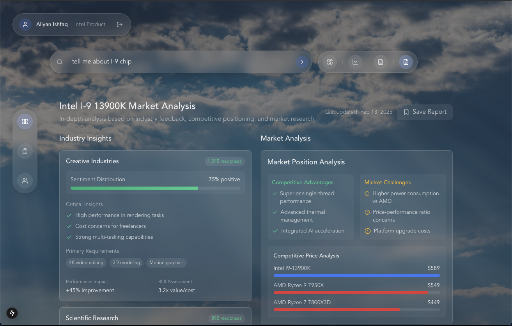

# AI Survey Simulation Platform

[](https://www.loom.com/share/88493cf639014566ab8c63f4b075792a)

## Overview

This platform simulates realistic survey responses by creating detailed persona profiles from real data. It generates nuanced, contextually appropriate responses that reflect how actual people with diverse backgrounds would answer surveys.

Built for market researchers and product teams, the system helps predict how different user segments might react to products, policies, or workplace changes without the cost and time of traditional surveys. Each virtual respondent maintains consistency across questions while exhibiting the natural variation found in human responses.

Key capabilities include parallel processing of multiple personas, theme detection across responses, sentiment tracking, and demographic insights—enabling detailed analysis without running a single real-world survey.

## Features

- **Persona-Based Response Generation**: Utilizes AI to create realistic personas from real data sources including employee reviews and product reviews.
- **Survey Simulation Engine**: Simulates survey responses across multiple personas simultaneously.
- **Advanced Analytics**: Provides detailed analysis of survey results, including sentiment analysis, theme identification, and response patterns.
- **Customizable Persona Types**: Supports multiple persona types (currently Intel employees and product reviewers).
- **Research Capabilities**: Enables deep research based on survey results and persona responses.
- **REST API**: Exposes functionality through a FastAPI-based REST interface.

## System Architecture

### Core Components

1. **Persona Management**
   - Manages the creation and storage of personas
   - Handles conversation history and personality traits
   - Supports different persona types (employee, product reviewer)

2. **Survey Simulation**
   - Orchestrates survey simulations across multiple personas
   - Processes questions in parallel for efficiency
   - Provides detailed response analytics

3. **LLM Inference**
   - Handles interactions with language models
   - Supports Azure OpenAI and Anthropic models
   - Implements ensemble methods for more accurate responses

4. **Analytics Engine**
   - Performs qualitative and quantitative analysis of responses
   - Generates insights about themes, sentiment, and patterns
   - Creates visualizations and metrics

5. **API Server**
   - Provides RESTful endpoints for all functionality
   - Supports question asking, survey running, and research

### Data Sources

- Employee reviews from sources like Glassdoor
- Product reviews from various platforms
- Custom-defined personas with detailed traits and characteristics

## Getting Started

### Prerequisites

- Python 3.8+
- API keys for OpenAI, Azure OpenAI, or Anthropic

### Installation

1. Clone the repository:
   ```bash
   git clone https://github.com/your-username/colony-backend.git
   cd colony-backend
   ```

2. Install dependencies:
   ```bash
   pip install -r requirements.txt
   ```

3. Configure environment variables (create a .env file with the following):
   ```
   OPENAI_API_KEY=your_openai_api_key
   AZURE_OPENAI_API_KEY=your_azure_openai_api_key
   AZURE_OPENAI_ENDPOINT=your_azure_openai_endpoint
   AWS_ACCESS_KEY_ID=your_aws_access_key
   AWS_SECRET_ACCESS_KEY=your_aws_secret_key
   AWS_REGION=your_aws_region
   ```

4. Run the server:
   ```bash
   python server.py
   ```

## Usage

### Running a Survey Simulation

1. Define your survey questions in JSON format
2. Select the persona type (INTEL_EMPLOYEE or INTEL_PRODUCT_REVIEWER)
3. Use the `/survey/run` endpoint to run the simulation
4. Analyze the detailed results

Example API request:

```json
POST /survey/run
{
  "title": "Employee Satisfaction Survey",
  "questions": [
    {
      "id": "1",
      "text": "How satisfied are you with the company culture?",
      "options": [
        {"id": "1", "text": "Very Satisfied"},
        {"id": "2", "text": "Somewhat Satisfied"},
        {"id": "3", "text": "Neutral"},
        {"id": "4", "text": "Somewhat Dissatisfied"},
        {"id": "5", "text": "Very Dissatisfied"}
      ]
    }
  ],
  "persona_type": "INTEL_EMPLOYEE"
}
```

Example response:

```json
{
  "question_results": {
    "1": {
      "question_type": "likert",
      "basic_statistics": {
        "frequencies": {
          "Very Satisfied": 15283,
          "Somewhat Satisfied": 12661,
          "Neutral": 11567,
          "Somewhat Dissatisfied": 11854,
          "Very Dissatisfied": 10635
        },
        "proportions": {
          "Very Satisfied": 0.24651612903225807,
          "Somewhat Satisfied": 0.20420967741935483,
          "Neutral": 0.18656451612903227,
          "Somewhat Dissatisfied": 0.19119354838709676,
          "Very Dissatisfied": 0.17150806451612903
        },
        "total_responses": 62000
      },
      "mean_reliability": 0.918,
      "agreement_metrics": {
        "top_box_score": 0.4507,
        "bottom_box_score": 0.3627,
        "net_score": 0.088
      },
      "theme_analysis": {
        "primary_theme": "Work Culture and Environment",
        "themes": [
          {
            "name": "Work Culture and Environment",
            "strength": 0.85,
            "sentiment": "mixed",
            "supporting_quotes": [
              "Employees appreciate the collaborative atmosphere but mention challenges with work-life balance",
              "The company culture encourages innovation but can be demanding"
            ]
          }
        ]
      },
      "network_analysis": {
        "clusters": [
          {
            "name": "Satisfied Senior Employees",
            "members": ["0", "1", "13"]
          },
          {
            "name": "Dissatisfied Junior Staff",
            "members": ["2", "3", "4"]
          }
        ]
      },
      "sentiment_analysis": {
        "stages": [
          {
            "stage_name": "Initial Positive Experience",
            "positive_score": 0.874,
            "neutral_score": 0.094,
            "negative_score": 0.032
          }
        ],
        "trend": "mixed"
      }
    }
  },
  "metadata": {
    "total_personas": 100,
    "total_questions": 1,
    "error_count": 2,
    "duration_seconds": 30.05
  }
}
```

### Asking Individual Personas

You can also interact with individual personas to get more detailed responses:

```json
POST /ask
{
  "persona_index": 0,
  "question": "What do you think about the company's work-life balance?",
  "persona_type": "INTEL_EMPLOYEE"
}
```

Example response:

```json
{
  "answer": {
    "response": "Based on my experience at Intel, the work-life balance is challenging. While the company does offer flexible working hours and some remote work options, the workload is often overwhelming. There's an unspoken expectation to be available outside regular hours, especially during product launches or critical projects. I've found myself working weekends more often than I'd like, which has affected my personal time. The competitive environment also creates pressure to put in extra hours to keep up with colleagues. That said, it does vary by department - some teams have better boundaries than others.",
    "sentiment": "somewhat negative",
    "key_concerns": ["workload expectations", "availability outside hours", "weekend work"],
    "confidence": 0.87
  },
  "persona": {
    "name": "David Chen",
    "role": "Senior Software Engineer",
    "rating": 3.2,
    "location": "Santa Clara, CA",
    "recommend": false,
    "employment_status": "Current Employee, 3 years",
    "pros": "Good benefits, interesting technical challenges",
    "cons": "Poor work-life balance, pressure to overwork"
  }
}
```

### Deep Research

The platform allows for deep research based on survey results:

```json
POST /research
{
  "query": "What factors contribute to employee satisfaction?",
  "breadth": 5,
  "depth": 3,
  "concurrency": 2,
  "survey_results": {...},
  "persona_responses": [...]
}
```

Example response:

```json
{
  "research_summary": {
    "key_findings": [
      {
        "title": "Work-Life Balance Impact",
        "description": "Work-life balance emerged as the primary factor affecting employee satisfaction across all departments",
        "confidence": 0.92,
        "supporting_evidence": "87% of respondents mentioned work-life balance in their comments"
      },
      {
        "title": "Management Recognition",
        "description": "Recognition from management significantly influences overall job satisfaction",
        "confidence": 0.85,
        "supporting_evidence": "Employees with positive sentiment mentioned managerial recognition 3.5x more often"
      }
    ],
    "recommendations": [
      {
        "title": "Implement Flexible Working Hours",
        "description": "Introduce more flexible working arrangements to improve work-life balance",
        "priority": "High",
        "expected_impact": 0.75
      }
    ]
  },
  "research_process": {
    "sources_analyzed": 24,
    "completion_time": "00:02:35",
    "confidence_score": 0.89
  }
}
```

## Analytics Capabilities

Colony provides comprehensive analytics across multiple dimensions:

### 1. Basic Statistical Analysis

- **Frequency Distributions**: Count and percentage of responses for each option
- **Confidence Intervals**: Statistical reliability of the results
- **Top/Bottom Box Scoring**: Aggregation of positive vs. negative responses
- **Polarization Metrics**: Measures of how divided responses are

### 2. Thematic Analysis

- **Theme Identification**: Discovers key themes across responses
- **Sentiment Mapping**: Classifies themes by positive, negative, or mixed sentiment
- **Supporting Evidence**: Extracts representative quotes for each theme
- **Theme Connections**: Maps relationships between different themes

### 3. Network Analysis

- **Persona Clustering**: Groups similar respondents together
- **Shared Viewpoint Detection**: Identifies common opinions across groups
- **Divergent Opinion Mapping**: Highlights where groups disagree
- **Influence Networks**: Shows how certain personas may influence others

### 4. Sentiment Flow Analysis

- **Stage-Based Sentiment**: Tracks sentiment across different stages of experience
- **Sentiment Trends**: Identifies patterns of improving or declining sentiment
- **Critical Points**: Pinpoints moments where sentiment shifts significantly
- **Key Drivers**: Identifies factors that drive sentiment in each stage

### 5. Meta-Analysis Capabilities

- **Alignment Analysis**: Measures how different persona types align in their responses
- **Consistency Analysis**: Evaluates response consistency across questions
- **Demographic Insights**: Generates findings about how different groups respond
- **Key Findings Synthesis**: Automatically generates the most important overall insights

## Extending the Platform

### Adding New Persona Types

1. Define a new persona type in `schema.py`
2. Create data loading logic in `personas.py`
3. Implement prompt generation in `prompts.py`
4. Update the API endpoints in `server.py`

### Customizing Analysis

The analysis capabilities can be extended by modifying:
- `response_analytics.py` for quantitative analysis
- `qualitative_analytics.py` for theme identification
- `survery_meta_analysis.py` for meta-analysis


For cloud deployment, a `fly.toml` file is included for deployment on Fly.io.

